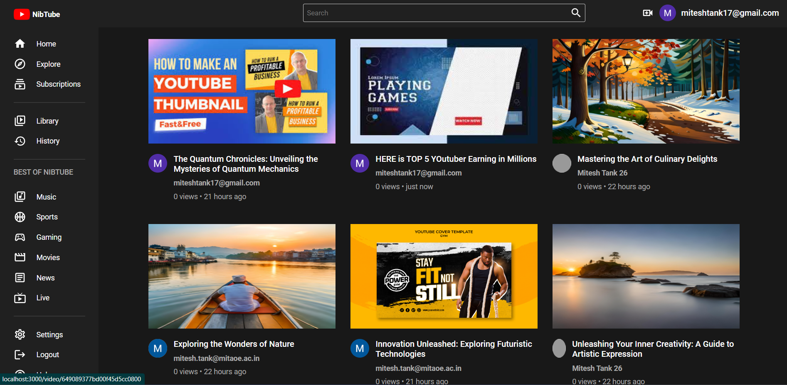
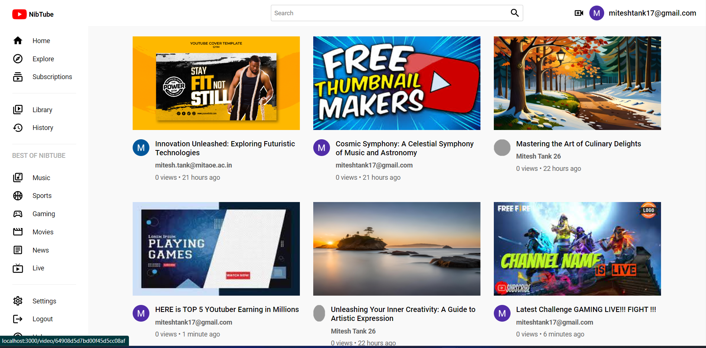
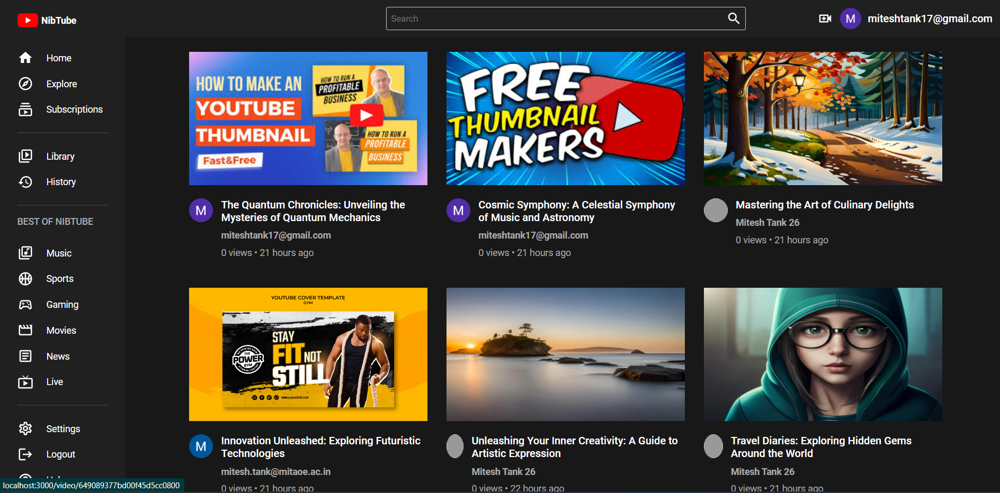
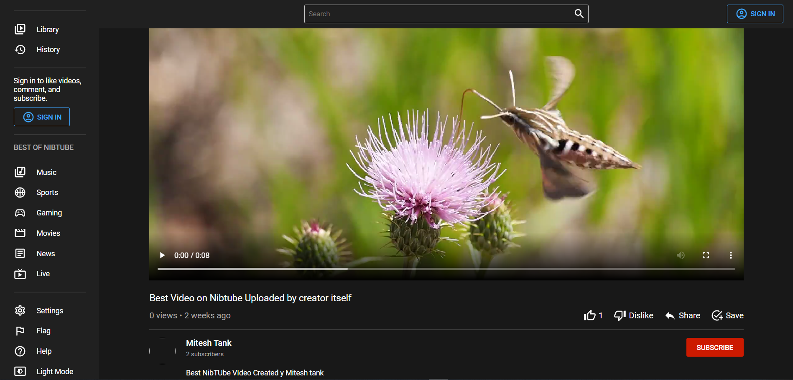
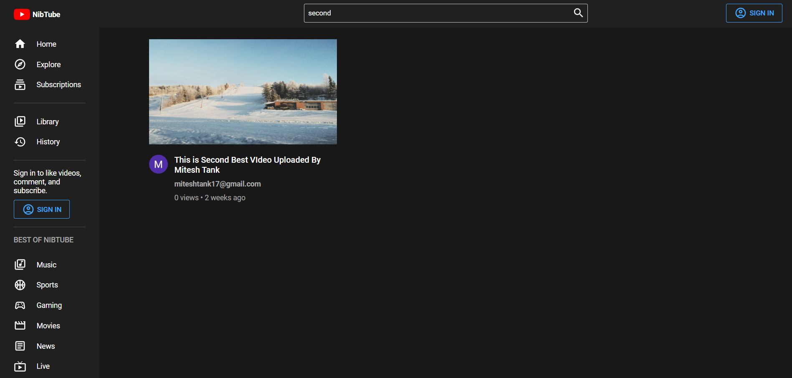
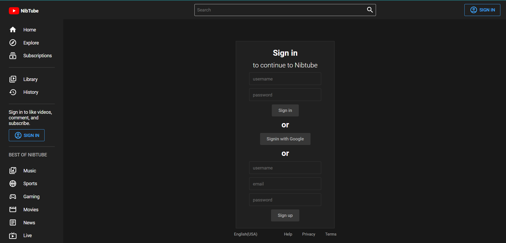
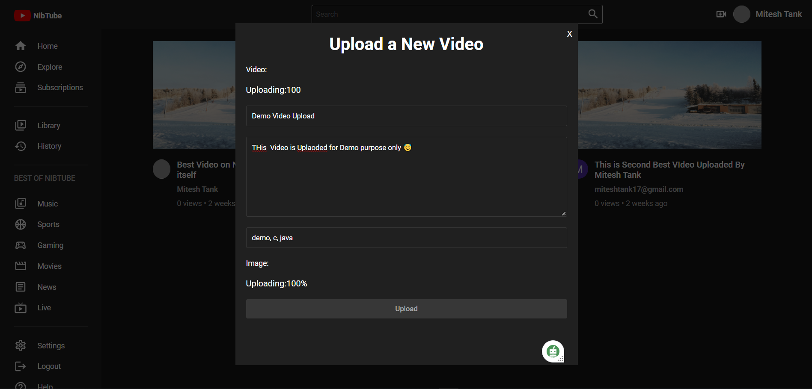

# YouTube Clone Using MERN Stack

- Live Site URL: [Live site URL](https://nibtube.netlify.app/)
- Video Demo : [Video Demo](#)
- Code Walkthrough : [Code Walkthrough]()

## Table of contents

- [YouTube Clone Using MERN Stack](#youtube-clone-using-mern-stack)
  - [Table of contents](#table-of-contents)
  - [Overview](#overview)
  - [My process](#my-process)
    - [What I learned](#what-i-learned)
    - [Built with](#built-with)
  - [🖥️ Tech Stack](#️-tech-stack)
    - [🚀 Features🔥](#-features)
    - [😇 Upcoming Features🔥](#-upcoming-features)
  - [Sneak Peek 🙈](#sneak-peek-)
  - [Useful resources](#useful-resources)
  - [📬 Contact](#-contact)

## Overview

- Welcome to my YouTube Clone application! Built using the powerful MERN Stack, this platform emulates the functionality and experience of the original Youtube. With a sleek user interface and seamless navigation, users can easily search, view, and upload videos. Leveraging the MERN (MongoDB, Express.js, React, and Node.js) technologies, this app offers real-time updates, user authentication, and personalized recommendations, making it a dynamic and engaging platform for sharing and exploring videos.
## My process

- I used my knowledge of the MERN i have to build the Clone app .
- Learned and Used **React Redux** for the firstime
- **All Links are in [Useful resources](#useful-resources).**

### What I learned

- Learned the complete MERN stack Development
- Detailed understanding of the backend and frontend
- Learned how to manage the state of the application using Redux
- Combined the frontend and backend to make a full stack application
- Had experience with MongoDb Atlas
- Learned how to deploy the app on heroku

### Built with

- Complete MERN Full Stack
- MongoDb Express React Node

## 🖥️ Tech Stack

**Frontend:**

&nbsp;
&nbsp;
&nbsp;
&nbsp;

**Backend:**

&nbsp;
&nbsp;
&nbsp;
&nbsp;
&nbsp;

**Deployed On:**

### 🚀 Features🔥

- User Login and Signup
- Video Upload
- Video Like and Dislike
- Subscribe to Channel
- Light and Dark Mode

### 😇 Upcoming Features🔥

- Fixing Minor Bugs
- Recommendation Section
- Comments Section

## Sneak Peek 🙈

<table>
  <tr>
    <td></td>
    <td></td>
  </tr>
  <tr>
    <td></td>
    <td></td>
  </tr>
</table>

## Useful resources

- [Complete NodeJs Developer Bootcamp 2022](https://www.example.com) - This is the Udemy Course that i followed to learn NodeJs💛.
- [Thapa Technical](https://www.example.com) - This is the Youtube Channel that i followed to learn ReactJs💙.
- [Redux in One Video](https://www.example.com) - This is the Youtube Video that i followed to learn Redux💜.
- Also Some Online Blogs and Articles.

## 📬 Contact

If you want to contact me, you can reach me through below handles.

© 2023 Mitesh Tank ❤

